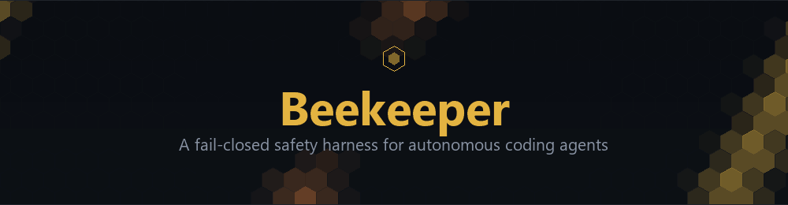

<p align="center">
  
</p>

# Beekeeper

**Threat intelligence for autonomous coding agents.**

Beekeeper sits between an agent and its tools. It evaluates each package install, file access, network call, and tool call before it runs, against corroboration-based threat intelligence and structural policy, and blocks what does not pass. It is a single static Go binary with no external runtime dependencies.

The threat is the supply chain, not the model. Your agent installs the dependency the task needs, with no way to know that version shipped a credential stealer after its training cutoff. Beekeeper carries the fresh, corroborated knowledge the model lacks and checks the install before it runs. What it covers, and where coverage stops, is in [Harness support](#harness-support) and [Known gaps](#known-gaps). Read those before you trust it with anything.

> **v1.0.0** is the first public release. License: Apache 2.0.

---

## Why

A coding agent's knowledge of which packages are safe is frozen at its training cutoff. It installs `some-build-tool@1.4.2` because the task needs it, with no way to know that version published a postinstall credential stealer after that cutoff, and no instinct to treat a routine dependency as a risk. The 2026 supply-chain wave (Nx Console, Shai-Hulud, the npm trusted-publisher OIDC attacks) targets exactly that gap: code that reaches a developer through a trusted, well-meaning install. Beekeeper puts a corroborated threat check, synced every two hours, with a second-source requirement and an audit trail, in front of the install.

## Install

```sh
go install github.com/home-beekeeper/beekeeper/cmd/beekeeper@latest

# Sync the threat catalog
beekeeper catalogs sync

# Install the hook for your agent (Claude Code shown)
beekeeper hooks install --target claude-code
```

Check a tool call by hand (stdin is the tool-call JSON):

```sh
echo '{"tool_name":"Bash","tool_input":{"command":"cat ~/.ssh/id_rsa"}}' \
  | beekeeper check --hook claude-code
# exit 2 + a Claude Code deny payload: the read is blocked before it runs
```

Releases are reproducibly built, Sigstore-signed (keyless via GitHub Actions OIDC), with SLSA Level 3 provenance and a CycloneDX SBOM. The verification commands are on the [installation page](https://github.com/home-beekeeper/beekeeper/blob/main/docs).

## What it does

Beekeeper is three layers. Each has a different job, and they are not the same strength.

### 1. Hook and gateway enforcement (the layer that blocks)

A PreToolUse hook runs `beekeeper check --hook <harness>` before each tool call. On a block it exits `2` and emits the per-harness deny payload the harness actually honors (`hookSpecificOutput` for Claude Code, `{"action":"block"}` for Hermes). Exit `2` is deliberate: exit `1` reads as a hook error and most harnesses ignore it, so the tool would still run.

For harnesses without a pre-exec hook, an MCP gateway intercepts in-flight MCP tool calls through a local proxy.

Sensitive-path enforcement blocks agent reads, and shell-redirect writes, of credential paths outside the working directory (`~/.ssh`, `~/.aws`, `~/.cargo/credentials`, `.env` globs, editor MCP config dirs), with canonicalization that closes tilde, `$VAR`, symlink, Windows alternate-data-stream, and trailing-dot evasion. The block merges most-restrictive-wins, so an allowlist cannot downgrade a credential-read block.

Everything here is fail-closed: a crash, timeout, oversized input, or missing index produces a block, not an allow. `fail_mode: open` is an explicit opt-in, and a project-level config can set it, so the default is fail-closed but it can be turned off per working tree.

### 2. Catalog corroboration (the supply-chain layer)

Block decisions require a second factor:

| Sources flagging a package | Action |
|----------------------------|--------|
| 1 | warn |
| 2 | block |
| 3+ | block + quarantine |

Only signed sources count toward a block; an unsigned source can warn but never block alone. An adversary controlling one catalog source can raise warnings but cannot force a block. Sources are Bumblebee, OSV, and Socket. Per-severity thresholds let a `critical` match escalate at a lower count, guarded against a single poisoned or wildcard entry.

The package-manager nudge catalog-matches `npm`, `pnpm`, `bun`, and `yarn` installs before they run, including chained (`cd x && npm install ...`) and env-prefixed commands. Unlisted managers (`deno`, `mvn`, `nuget`) currently parse as "no package identified" and are allowed; the behavioral layer is the second signal there.

On a catalog-sync delta, a read-only cross-reference checks your already-installed packages against the new intelligence. A corroborated hit can move to a reversible quarantine (a directory move plus a restore manifest). This is opt-in and dry-run by default: a fresh install quarantines nothing, and the permanent purge is always human-gated.

On a confirmed incident, Beekeeper also records the package to a local, append-only, owner-only adjudicated corpus (v1.4.0). Off the hot path (only during a `catalogs sync`), an adjudication engine assigns the outcome and writes a confirmed-malicious package to a local catalog overlay, so that machine enforces it immediately, ahead of the upstream feed. Local-only: nothing leaves the machine (see [docs/THREAT-MODEL.md §13](https://github.com/home-beekeeper/beekeeper/blob/main/docs/THREAT-MODEL.md)).

### 3. Sentry behavioral correlation (detection-only, opt-in)

A privileged, opt-in monitor (`beekeeper protect install`) correlates process, file, and network events into rules `SENTRY-001` through `SENTRY-008`: credential-file clusters, credential-CLI bursts, first-outbound phone-home, fresh-extension correlation, exfil-signature fusion, an agent-CLI credential cluster, a generalized exfil fusion, and persistence-location writes.

Rules fire for processes descended from an editor (`code/cursor/windsurf/codium`) or a known agent CLI (`claude/codex/cursor-agent/gemini/copilot/qwen/aider/opencode/hermes`), so a standalone-terminal agent is in scope, not only an editor extension. File-write events are ingested on Linux, macOS, and Windows; DNS query events on Linux and Windows.

Sentry is detection-only: it writes audit records, it does not quarantine or kill. A catalog hit can tighten correlation on a flagged artifact's process subtree, still detection-only.

## Harness support

17 agent harnesses, three tiers. Full table with config locations and caveats: [docs/harness-support-matrix.md](https://github.com/home-beekeeper/beekeeper/blob/main/docs/harness-support-matrix.md).

| Tier | Harnesses | Coverage |
|------|-----------|----------|
| 1: full hook-block | Claude Code, Codex, Cursor, Augment, CodeBuddy, Qwen Code, Gemini CLI, Copilot, Antigravity, Windsurf | Pre-exec hook: exit 2 + per-harness deny payload |
| 2: hook-block, caveats | Hermes, Cline, OpenCode | Hermes is fail-open; Cline is macOS/Linux only; OpenCode misses subagent `task` calls |
| 3: MCP gateway only | Kilo, Trae, Continue, OpenClaw | MCP tools intercepted; native Bash and file tools are UNGUARDED |

**Verification scope.** Only Claude Code is live-block-verified end to end (a credential read fires the hook, the tool does not run, the block is audited). The other 16 harnesses are implemented against their documented contracts and contract-shape tested (correct exit code and deny payload), but not run against a real harness in CI. The live-block procedure for each is enumerated with sign-off fields in [docs/validation-register.md](https://github.com/home-beekeeper/beekeeper/blob/main/docs/validation-register.md).

## Known gaps

Documented so you do not build false confidence. None of these relax the fail-closed enforcement path; most are detection-coverage or configuration-trust limits.

- **Only Claude Code is live-verified.** The other 16 are contract-tested, not run against a real harness.
- **Tier-3 native tools are unguarded.** Kilo and Trae have no upstream hook; only MCP tools route through the gateway. Native Bash, file, and shell tools bypass Beekeeper.
- **Hermes is fail-open**, and Windsurf is fail-open on any non-2 exit. OpenCode misses subagent `task` calls.
- **A project config can relax fail-closed.** `.beekeeper/config.json` with `{"fail_mode":"open"}` is honored for that tree.
- **Gateway remote-bind is plaintext.** `--bind 0.0.0.0` exposes the proxy over plain HTTP with the bearer token in cleartext; the `allow_remote_gateway` gate is not implemented. Keep it on loopback.
- **Unlisted package managers.** `deno`, `mvn`, and `nuget` parse as "no package identified" and are allowed by default. Command chaining and env-prefixed installs are handled.
- **DNS is ingested but not correlated**, so DNS-tunnel exfiltration is captured but not yet detected. There is no process-memory event source, so `/proc/<pid>/maps` secret scraping is undetected.
- **`release_age` and `lifecycle_script_allowlist` policy rules are accepted but not enforced** (informational only).
- **The first-responder quarantine and Sentry escalation are wired and CI-validated, not yet red-team-proven** against a purpose-built live exploit. The structure is proven; the live kill is not yet.
- **Residual, host-undetectable:** exfil over legitimate endpoints (GitHub API dead-drops, AWS-service C2, npm-registry propagation). Architectural mitigation only.

## How it is validated

Coverage is auditable, not asserted. Validation splits three ways:

- **Tier A (locally testable):** held at full coverage by a gate that accounts for every production Go file as tested or as a reason-coded, fail-closed allowlist entry. A 17-harness conformance suite golden-file-tests every installer config and deny contract.
- **Tier B (platform-bound):** a CI matrix across two Linux kernels, macOS, and Windows, exercising eBPF, eslogger, ETW, and Unix peer-cred. Five fuzz targets, including the Sentry rule evaluator, run as a blocking release gate.
- **Tier C (irreducibly manual):** a signed register with a live-block procedure and a sign-off line for each of the 16 non-Claude-Code harnesses and the gated-model sidecar.

Details: [docs/validation-posture.md](https://github.com/home-beekeeper/beekeeper/blob/main/docs/validation-posture.md).

## Architecture

- Single static binary. `cmd/beekeeper/main.go` is thin Cobra wiring; all logic lives in `internal/`.
- `internal/policy` is a pure function library with no I/O, called identically from the hook handler, the gateway, and the Sentry correlation layer.
- Fail-closed by default across every enforcement path.
- The hook handler loads the catalog via mmap, no cold-load per invocation.
- `internal/corpus` is a local adjudicated-corpus loop: append-only, owner-only, redaction-first, with no network imports (enforced by a test), and adjudication runs off the hot path. Local-only: nothing leaves the machine.

Beekeeper also self-protects: an agent cannot read or write its state directory, overwrite the binary, remove its own hook entry, or invoke Beekeeper's mutating subcommands through Bash. A separately-keyed `beekeeper-self` feed lets a tampered build refuse to run.

## Security

Vulnerability disclosure policy: [SECURITY.md](https://github.com/home-beekeeper/beekeeper/blob/main/SECURITY.md). Threat model: [docs/THREAT-MODEL.md](https://github.com/home-beekeeper/beekeeper/blob/main/docs/THREAT-MODEL.md).

## License

Apache 2.0. Threat intelligence is inspired by Perplexity's [Bumblebee](https://github.com/perplexityai/bumblebee) (Apache-2.0), consumed as a catalog source, with [Pollen](https://github.com/home-beekeeper/pollen) as the Windows-support scanner fallback. Beekeeper bundles no Bumblebee or Pollen code; both are invoked as subprocesses.
